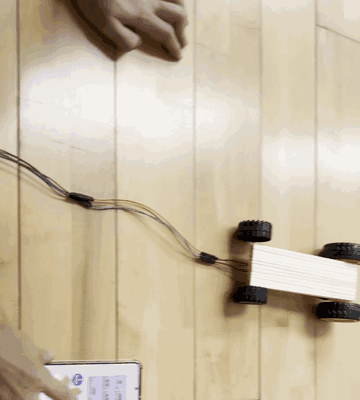

# 예선 — 화장실용 로봇청소기

기존 로봇청소기가 거실·방 청소에 한정된 점에 착안해, **물 분사 · 세제 분사 · 솔질 · 송풍 건조**까지
수행하는 화장실 전용 청소 로봇을 제작했습니다.

- **MCU**: ATmega328P @ 16MHz (Arduino UNO R3 보드, 단 `Serial` 등 Arduino 라이브러리 미사용 — 레지스터 직접 제어)
- **총 부품비**: 72,552원



## 구현 내용

| 기능부 | 핀 | 제어 방식 |
|---|---|---|
| 주행 바퀴 (H-브릿지) | PC0~PC3 | Timer2 소프트웨어 PWM (~1.95kHz), GO/BACK 배타 구동 |
| 초음파 센서 | TRIG=PC4, ECHO=PC5 | Timer1 입력 펄스폭 측정 (0.5us/tick) |
| 물 / 세제 펌프 | PD4~PD7 | Active-High ON/OFF, 풀다운으로 노이즈 오동작 방지 |
| 솔질 / 송풍 팬 | PB0~PB3 | Active-Low, CW/CCW 개별 제어 |
| 블루투스 (HC-06) | RXD=PD0, TXD=PD1 | UART 레지스터 직접 제어, 9600-8N1 |

## 원격 제어 프로토콜

App Inventor로 제작한 안드로이드 앱에서 **1바이트 명령 문자**를 전송합니다.

```
기능부  w=물  c=세제  b=솔질  a=송풍  f=정지
이동부  g=전진  d=후진  l=좌회전  r=우회전  s=정지  A=자동주행
```

## 설계 포인트

- Auto/Manual 어느 모드에서든 같은 방향이면 **동일한 PWM 듀티**가 적용되도록 속도 로직을 분리
- H-브릿지의 GO/BACK 신호가 동시에 HIGH가 되지 않도록 상호 배제 처리 (관통전류 방지)

## 한계 / 개선 과제

- 초음파 기반 완전 자율주행: 센서 반사 noise 처리 미흡으로 수동 모드 위주 운용
- 방수·방진: 전체 회로 결선 상태에서의 실링 미완성
- 올인원 통합: 바퀴가 회로 설비 무게를 견디지 못해 이동부/기능부 분리 구성

## 파일

- `src/cleaning_robot.ino` — 전체 펌웨어
- `docs/schematic.pdf` — 회로도
